*

Three ways of debugging wheats/chaffs/tests.

1. Using command-line pyret (from pyret-npm v0.0.22)

2. Make pyret-lang#anchor and use localhost:3000

3. Commit/push to pyret-lang#anchor, commit empty and push to
code.pyret.org#horizon and use pyret-horizon.herokuapp.com

#1 is best. Ensure no explicit include/import of cpo or lists
(because these are not visible/available here, altho cd probly
fudge using path settings). (Using small script to clean up this
aspect.)

#2 include cpo. Sometimes import lists as L is used. Type errors,
some of which can be corrected by explicitly typing anonymous
function occurrences.

Also implementation of certain things (%within) behave differently than in
pyret-npm. This makes wheats that used to succeed now to fail.

_ (used in nile) is thrown as error.

(I had to modify the cpo.arr, options.arr to provide data * in
addition to what they do. I was leery of going beyond this
because this can create global -- and even lexical! -- name
clashes if done indiscriminately.)

Error messages show just the error templates without the instance or
context. I.e., What but not where.

#3's include cpo is NOT as powerful but it is not clear what
additional imports to use that work without outright error. Basic
things like type List fail. We really need to make whatever cpo
(and lists) modules being loaded in the web version be as
powerful or at least equivalent to what I get on pyret-lang
localhost.

I obviously don't want to mess with code.pyret.org#horizon as it's being
relied upon. It is not clear what else relies on its integrity or
staying stable in whatever way it is. I would like instead a
series of module incantations that I can consistently add to the
wheats/chaffs before putting them in gdrive. I tried looking at
essentials2021 as an alternative to cpo, but while it seems
different, it doesn't work seamlessly either.

Best case scenario: Not necessarily have the localhost and heroku
versions work like pyret-npm, but at least ensure that there is a
standard module importation(s) that can be used to mimic
pyret-npm. For this to happen, the modules themselves need to be
updated appropriately, as existing combination of modules all
fail in their own way.

This will go a long way, even though I still have to worry about
missing type annotations and possibly timeout issues.

*

Syntactic/Semantic differences over and beyond which modules are
used:

Parlay is very finicky about type annotations (perhaps by
intent?). Anonymous function parameters should be annotated. Not
always easy to get by with using Any. E.g.,

Type checking failed because of a type inconsistency. The type
constraint Boolean was incompatible with the type constraint Any

mapDispatchToProps() in Connect(FailureComponentUnconnected) must
return a plain object. Instead received undefined.

Warning: Each child in a list should have a unique "key" prop.

Check the render method of Chat/CheckResults

How do you go about debugging this?

While this seems benign, may be indicative of deeper problems

*

docdiff

Using command-line Pyret, wheats pass. But they fail on localhost
Parlay because is%(within(...)) doesn't seem to be correct in
pyret-lang#anchor.

*

sortacle

push through localhost

include cpo

 # import lists as L

Using lists.* in place of L.*

web version: List not defined.

*

nile

_ can't be used. (Works locally)

*

contfracs

{empty}.value causes type error (non-existent field)
but not with cmdline Pyret! (perhaps because Parlay type checking
is very strict)

removing those lines out for now

Also, seems to be stressing any timeout limitations:

AssertionError: execution completed in restore mode  (which is in
generated file build/worker/main.js)

== Running the `fact` assignment

This is a very simple assignment (not part of the Brown group).
It does not use lists and doesn't require `include cpo`.

While loading, there is this JS console warning (and this is common to all
assignments) but it doesn't seem to affect correctness.

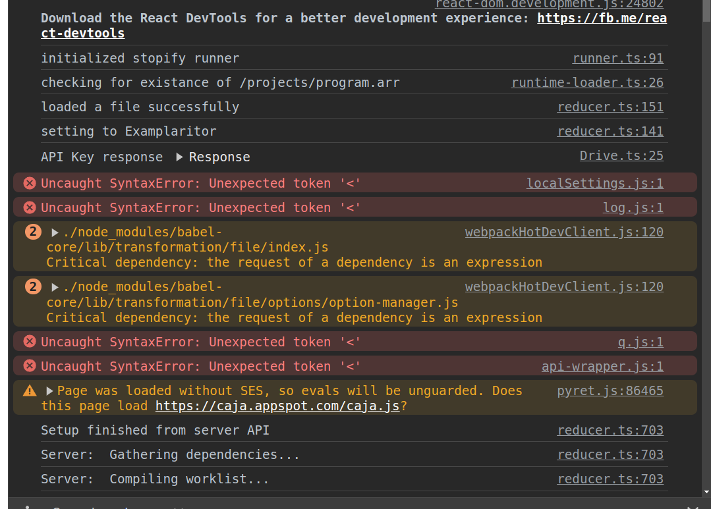

Updating responses provides the correct output:

== Running the `docdiff` assignment -- misleading results

The `docdiff` shows wheats failing (which they never should).

This is not because of any erroring (ill-formed-ness) of the
files themselves, but the checks fail when they shouldn't. It
looks like tests like

  overlap(cats, dogs) is%(within(0.000000000001)) 1/2

are failing because the LHS is true rather than 1/2.

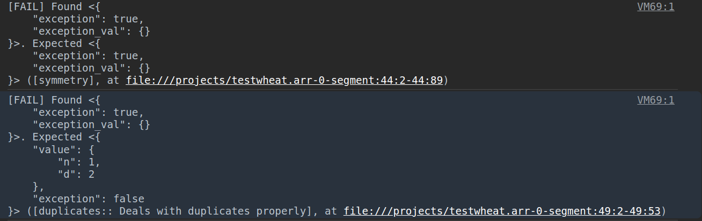

== Running the `sortacle` assignment -- misleading results

`sortacle` shows wheats failing!

Tests throwing exceptions when they shouldn't:

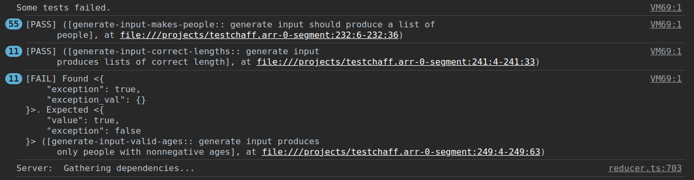

Other errors in the JS console:

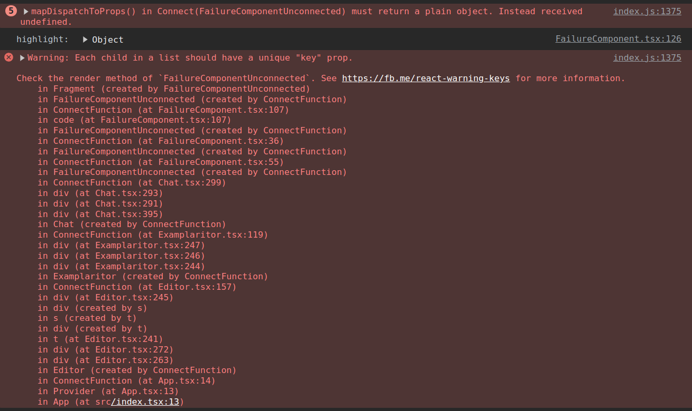
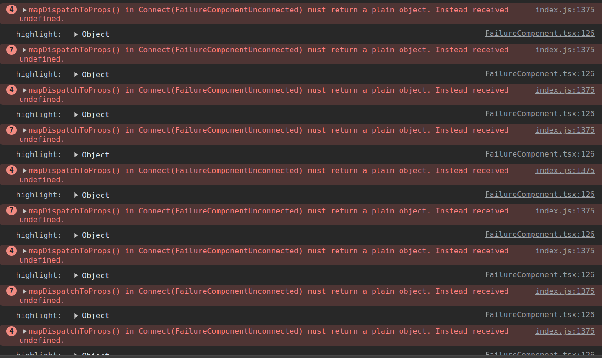

== Errors while running the `filesystem` assignment

The following errors show up on the JS console while running a
best-effort modified `filesystem` assignment (i.e., correct all
the include pathnames, and ensure `include cpo` is added when a
file does anything beyond basics).

While loading (i.e., before attempting "Update responses"), we
get

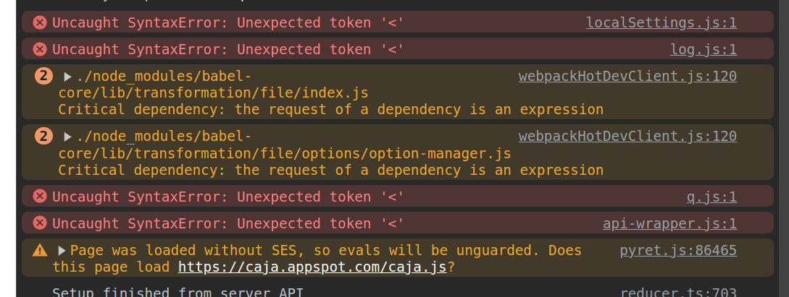

(This above is not unique to `filesystem`. It happens before any
engagement with the particular assignment in `projects/`. See
above in notes for the `fact` assignment.)

On "update responses", we get

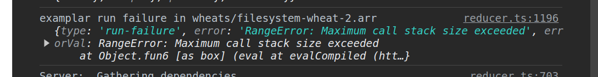
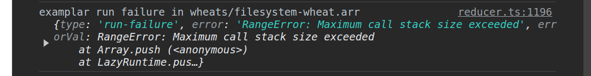
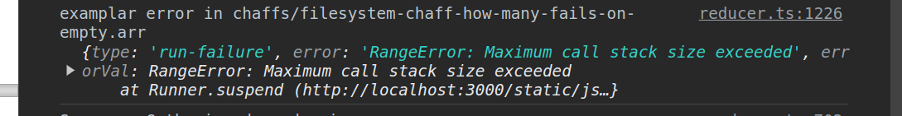

== Errors while running `updater`

Same `Each child in a list should have unique "key" prop` error warning as for
sortacle.

Same `mapDispatchToProps() in
Connect(FailureComponentUnconnected) must return a plain object.
Instead received undefined.` diagnostic as for sortacle.

Had to include `random` in `cpo.arr`.

On 'update responses', error got:

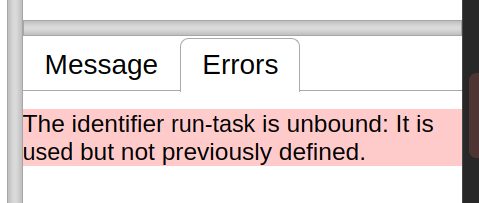

However, trying to include `run-task` in `cpo.arr` (as a provide
from `G`) produces a compile error!

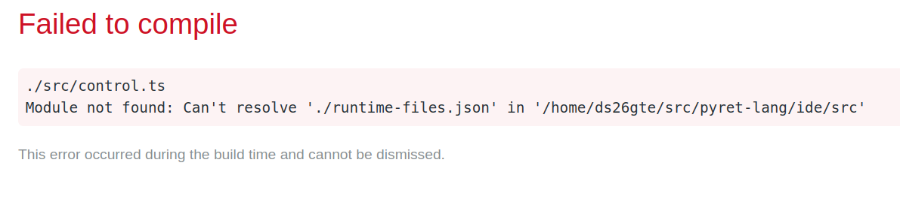
